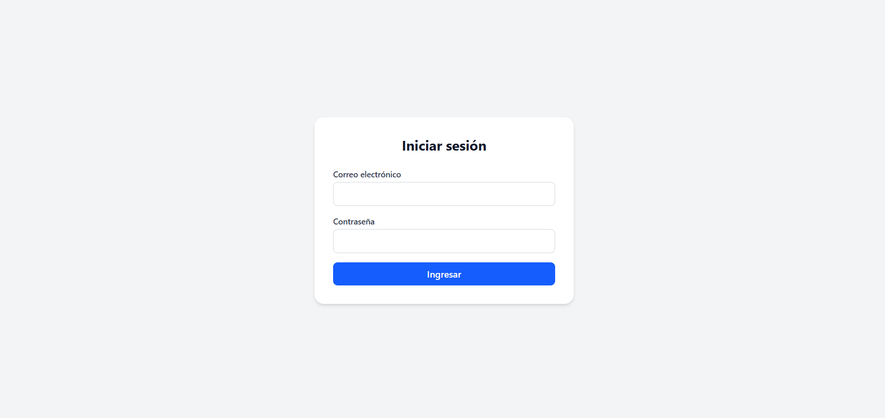
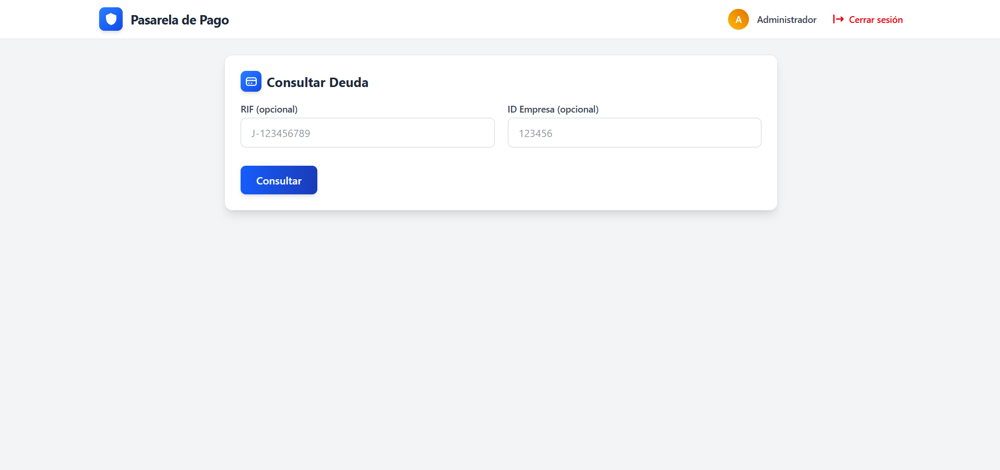
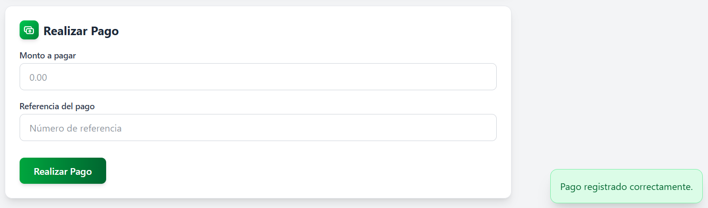

# Pasarela de Pago 💳💵


> Esta solución es una pasarela de pagos especializada que permite a **bancos venezolanos** (siendo Bancamiga el primero en implementarla) ofrecer a las empresas registradas un sistema integrado para: Consultar en tiempo real las deudas previsionales con el IVSS y Liquidar dichas obligaciones mediante transacciones seguras.
> Su propósito central es **automatizar el pago de aportes al IVSS** mediante una interfaz bancaria estandarizada, eliminando trámites manuales y reduciendo errores en la declaración de obligaciones.

---

## 📁 Estructura del Proyecto

```bash
Pasarela-Pago-App/
├── Pasarela-Pago-API/    # Backend Laravel 10
│   ├── app/              # Lógica de Aplicación
│   ├── config/           # Configuración
│   └── routes/           # Rutas API definidas
│
└── Frontend/             # Frontend React.js
    ├── public/           # Recursos estáticos
    ├── src/              # Código fuente
    └── package.json      # Dependencias
```

---

## ⚙️ Tecnologías Usadas

- **Laravel 10** – Backend API con autenticación Sanctum y lógica de procesamiento de pagos.
- **React.js 19.1** – Frontend interactivo para consulta de deudas y transacciones.
- **Tailwind CSS 4.1.7** – Sistema de diseño responsive con gestión de temas.
- **PostgreSQL** – Base de datos con triggers y procedimientos para actualización automática de saldos.
- **Docker** – Containerización de servicios y dependencias.
- **Nginx** – Servidor web para frontend y reverse proxy para API en entorno de producción.


---

## 🧑‍💻 Funcionalidades

✅ Autenticación segura mediante tokens  
✅ Búsqueda y consulta en tiempo real de deudas empresariales  
✅ Simulación de transacciones de pago con actualización automatizada de saldos  
✅ Mecanismo de trigger/procedimiento para gestión de deudas  
✅ Arquitectura escalable preparada para integración con múltiples bancos  
✅ Generación de reportes en PDF  
✅ Registro de Usuarios sólo para Administradores  

---

## 📸 Capturas de Pantalla

<p><em>Vista Previa de las principales pantallas de la aplicación:</em></p>

<p><strong>Login</strong></p>
<p align="center">
  
</p>

<p><strong>Dashboard</strong></p>
<p align="center">
  
</p>

<p><strong>Detalle de búsqueda</strong></p>
<p align="center">
  
</p>

<p><strong>Pago realizado</strong></p>
<p align="center">
  
</p>

---

## 🚀 Instalación y Ejecución

### 🔧 Backend (Laravel)

```bash
cd Pasarela-Pago-App/Pasarela-Pago-API
composer install
cp .env.example .env
php artisan key:generate
php artisan migrate --seed
php artisan serve
```

### 💻 Frontend (React.js)

```bash
cd Pasarela-Pago-App/Frontend
npm install
npm run dev
```

> Asegúrate de que el archivo .env está configurado con tu conexión a tu base de datos PostgreSQL.

---

## 📡 API Endpoints

| Method | Route                | Description              |
|--------|----------------------|--------------------------|
| GET    | /api/deuda/consultar       | Consulta de Deuda |
| POST   | /api/login           | Inicio de Sesión con Token Bearer |
| POST   | /api/logout           | Cierre de Sesión |
| POST   | /api/register        | Registro de Usuarios   |
| POST   | /api/deuda/pagar        | Pago de Deuda   |

---

<!-- ## 🧪 Testing

The system includes tests to verify endpoints and rate limiting:

```bash
php artisan test
```

Verified test cases:

✅ List citizens  
✅ Search citizen by ID number and nationality  
✅ Register new citizen  
✅ Update citizen  
✅ Request limit enforcement  
✅ Blocking after exceeding request limit  
✅ Reset after cooldown period  

--- -->

## 📄 Licencia

Este proyecto es una réplica de demostración, creada exclusivamente para:

- Pruebas técnicas
- Propósitos de portafolio

Queda prohibido cualquier uso comercial sin autorización expresa por escrito.

---

## 🙋‍♂️ Desarrollador

Desarrollado por [William Villegas](https://www.linkedin.com/in/william-villegas-ab3b94215/)
